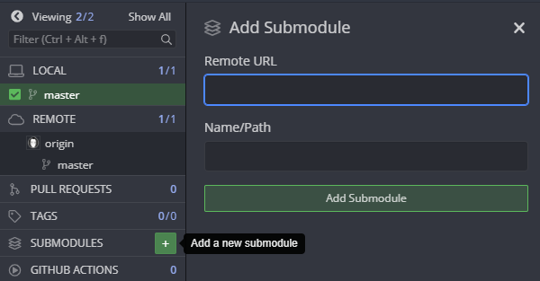
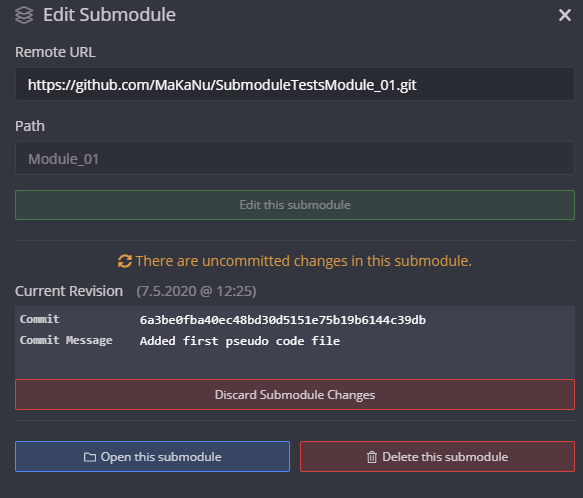

# SubmoduleTestsMaster

This Repository is for testing and documentation purposes. This paren repo will only include this README.md file and the submodules. The Submodules will include some pseudo-code to apply changes that could be commited.

Furthermore this explanation will include introduction to handle submodule with the Git Commands, Git Extensions and Gitkraken.

## Gitkraken

This Section includes the Workflow for Gitkraken. Starting with the set up of the repo , continuing with updating the submodules and ending with setting up the repo for a special commit of the submodule.

### Integrate the Submodules

To include the submodule into the parent repo, click on the appearing green plus button next to "SUBMODULES". This will open a window with two entry fields for the remote-URL and the path to the submodule inside the parent repo. After entering the URL the path will automatically show the reponame of the module. This path can be changed to any path/name.

After including the submodule the paren Repo needs to commit the changes. The changes are already added to the HEAD.

### Update the Submodules from the parent repo

If you change/add a file on a submodule Gitkraken show that changes are applied to the specific submodule but it is not possible to stage the changes at the moment. First you need to commit the changes in the submodule.

#### Open/apply the submodule from Diff View

When the changed but not-stage-able module is clicked the Diff View is opening. It says that there are uncommitted changes in the submodule and provides a Button to open the submodule. The submodule is then opened as a normal Repo and the changes could be commited. To switch back to the parent repo closing the Repo as ussual is not the workflow. Instead just close the submodule from tab bar as shown on the picture below. This will reopen the parent repo, otherwise the parent repo will be closed also.

Now the "Diff View" for the changed module shows the new commit and is stageable. 

#### Apply the submodule from main Window

After changing files in the submodule the specific module shows that are changes available with an icon . By double-clicking the module a popup window will appear with informations abbout the module:

When the changes are commited in the submodule and the view is reseted to the parent repo, the changes needed to be commited for the parent repo aswell. This time by using the popup window explained above. The window includes now a new button for commiting the changes. This includes an automatic commit message. As usual the commit message could be changes for the last commit.

### Update the Submodules from their own repos

This workflow appears if, as example, the remote repo is controlled by another person. If the remote is changed the parent repo is still in sync with the submodule. Now if the module is opened the difference between local and remote repo will be visible. In this case the commit linked with the parent repo is tagged as HEAD. By double clicking the local master branch, the tag will be deleted an the local branch activated. Now it is possible to pull the changes from the remote master branch. By continuing as described above the changes will be applied to the parent repo.